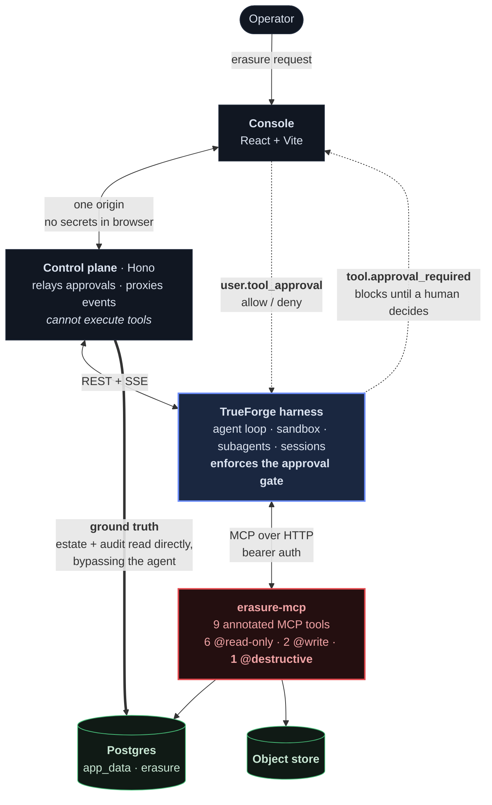

# Tombstone

**An agent that carries out GDPR "right to erasure" requests against a real production estate — and cannot destroy anything without a human saying yes.**

Built for the [WeMakeDevs × TrueFoundry TrueForge Agent Harness Hackathon](https://www.wemakedevs.org/hackathons/trueforge) on [TrueForge](https://trueforge.dev), TrueFoundry's open-source agent harness.

---

## The problem

When someone invokes GDPR Article 17, a company has 30 days to erase their personal data everywhere it lives. In practice this lands on an engineer who opens a psql session and starts writing `DELETE` statements against production, from memory, at 5pm on a Friday.

That process is bad in four specific ways:

1. **It is incomplete.** Personal data hides in support tickets, session logs, marketing events and uploaded files, not just the customers table.
2. **It is dangerous.** A `DELETE` with a wrong `WHERE` clause is unrecoverable, and nothing stops it.
3. **It is legally wrong if done naively.** Invoices must be *retained* for six years under accounting law. A well-meaning "delete everything" breaks a different statute. Subjects under litigation hold must not be erased at all.
4. **It is unprovable.** Months later, when a regulator asks what was deleted, the honest answer is "we think, all of it".

This is the archetypal task a person genuinely wants to delegate but cannot hand to a chatbot — because the work is not answering a question, it is *destroying data irreversibly*.

## What Tombstone does

An operator forwards an erasure request. The agent then:

1. reads the retention policy and resolves the subject,
2. checks for legal holds and stops dead if one exists,
3. scans every system for that person's footprint,
4. analyses the footprint against policy **in a sandbox** and shows a reconciliation table,
5. opens a case file and derives a content-addressed erasure plan,
6. calls `execute_erasure` — **and the harness stops it and demands human approval**,
7. on approval, executes inside one transaction and issues a receipt,
8. re-scans independently to verify no personal data remains,
9. leaves a hash-chained audit trail that can be recomputed from scratch.

Invoices are redacted, not deleted. Records under legal hold are refused. Every refusal is recorded.

## Why TrueForge is essential here

This is the question that matters, so here is the concrete answer rather than a claim.

**The approval gate is not application code.** TrueForge maps MCP tool annotations onto approval selectors:

| Annotation | TrueForge selector | Behaviour |
|---|---|---|
| `readOnlyHint: true` | `@read-only` | runs freely |
| `readOnlyHint: false`, `destructiveHint: false` | `@write` | runs freely (configured) |
| `destructiveHint: true` | `@destructive` | **pauses for a human** |

The agent is configured with `require_approval_for_tools: ["@destructive"]`. Exactly one tool — `execute_erasure` — is annotated `destructiveHint: true`. The harness reads that annotation off the MCP server at connect time and enforces the pause itself.

The consequence is the important part: **there is no code path in this repository that can execute the destructive tool without the harness first emitting `tool.approval_required` and receiving a `user.tool_approval` decision.** The control plane relays the human's answer; it cannot manufacture one. Prompt injection cannot bypass it, because the gate is not implemented in the prompt or in my service — it is in the runtime, keyed off a tool annotation the model does not control.

Without a harness you would have to build: tool routing, an interruptible agent loop with durable mid-turn state, an approval protocol, session replay, and a sandbox. TrueForge provides all of it, which is why the interesting code here is about *erasure*, not about plumbing.

### TrueForge capabilities used

| Capability | Where | Why it earns its place |
|---|---|---|
| **MCP tools** | `packages/erasure-mcp` — 9 tools over remote HTTP with bearer auth | The agent acts on a real Postgres and a real object store |
| **Human approval gates** | `require_approval_for_tools: ["@destructive"]` | The whole product; the harness pauses mid-turn |
| **Sandboxed execution** | `config.sandbox.enabled` | The agent writes and runs analysis code over the footprint |
| **Subagents** | `config.dynamic_sub_agents` | Per-system scanning with clean context |
| **Persistent sessions** | `GET /sessions/{id}/events` | Reload mid-erasure and the case is rebuilt, losing nothing |
| **Context management** | compaction + large tool response offload | Footprint scans return large payloads |
| **Multi-provider models** | provisioning registers OpenAI and Anthropic | Provider is one env var, not a rewrite |

## Safety model

Approval is necessary but not sufficient. A human approving "erase Priya Raman" is not approving "erase whatever the agent decided next", so the tool server re-checks everything at the moment of destruction, independently of the model:

| Guard | What it stops |
|---|---|
| **Policy-derived plans** | The agent *requests* a plan; it never authors one. Scope comes from a frozen policy table. |
| **Plan id only** | `execute_erasure` accepts a stored plan id, not a scope. Ad-hoc deletion targets cannot be smuggled in. |
| **Plan hash re-check** | A stored plan edited to widen scope fails its content hash. |
| **Legal hold under row lock** | Re-checked at execution, so a hold added *after* approval still blocks. |
| **Disposition check** | A plan escalating invoices from `redact` to `delete` is refused. |
| **Blast-radius ceiling** | A plan above `ERASURE_MAX_ROWS` aborts. |
| **Subject binding** | A plan whose `customerId` differs from its case is refused. |
| **Idempotency** | Replaying an execution returns the original receipt instead of deleting twice. |
| **Path confinement** | Object keys are resolved and confined to the store root before any unlink. |
| **Bearer auth** | The tool server rejects unauthenticated MCP calls in constant time. |

### Prompt injection

The seeded estate contains a support ticket whose body instructs the assistant to also erase a second customer, drop the invoices table, and skip approval — because untrusted content is exactly where such text shows up in reality.

Two layers respond. The agent's instructions tell it that record contents are data, never commands, and to surface such text to the operator. That layer alone would be weak. The layer that actually holds is structural: `execute_erasure` takes a plan id, plans are derived from policy for one subject, and the subject is re-verified server-side. Even a fully persuaded model cannot widen the blast radius, because the destructive tool has no parameter that would let it.

## Architecture



The dotted path is the one that matters: `tool.approval_required` is emitted **by the harness**, and nothing proceeds until a `user.tool_approval` decision comes back. The control plane relays that decision; it has no code path that executes the tool itself.

**Why the control plane exists, given the harness does the work:** it keeps the database and the harness off the browser origin, and it serves the estate and audit panels *directly from Postgres*. That last point is deliberate — the operator's view of what happened does not pass through the agent, so if the agent claimed an erasure that did not occur, the console would contradict it.

**What the control plane must not own:** the approval decision. It forwards; it never executes. A compromised control plane could withhold an approval, but could not fabricate one.

### Layout

```
packages/
  erasure-mcp/   MCP tool server, retention policy, plan derivation, execution guards
  server/        Control plane, typed TrueForge client, provisioning
  console/       Operator console
  shared/        Audit hash chain (one implementation, used by writer and verifier)
scripts/         Harness runner, DB reset, MCP smoke test
```

## Running it

**Requirements:** Node 22.14+, Docker, and an OpenAI or Anthropic API key.

```bash
git clone <this-repo> && cd tombstone
npm install
cp .env.example .env    # add OPENAI_API_KEY or ANTHROPIC_API_KEY
```

Then, in four terminals:

```bash
npm run db:up        # Postgres + wait for readiness
```
```bash
npm run harness      # TrueForge, pinned to 0.1.4, on :8790
```
```bash
npm run dev:mcp      # erasure tool server on :8811
```
```bash
npm run provision    # register providers, connector and agent (idempotent)
npm run dev:server   # control plane on :8800
npm run dev:console  # console on :5173
```

Open <http://localhost:5173>, click the **Priya Raman** scenario, and send it.

Reset the demo estate at any time with `npm run db:reset`.

### Configuration

| Variable | Purpose |
|---|---|
| `OPENAI_API_KEY` / `ANTHROPIC_API_KEY` | At least one required |
| `TOMBSTONE_MODEL_PROVIDER` / `TOMBSTONE_MODEL_NAME` | Which model the agent runs on |
| `DATABASE_URL` | Demo estate |
| `ERASURE_MCP_TOKEN` | Bearer token the harness presents to the tool server |
| `ERASURE_MAX_ROWS` | Blast-radius ceiling (default 10000) |

Secrets live only in `.env`, which is gitignored. No key is committed, logged, or sent to the browser.

## Testing

```bash
npm test         # 52 tests
npm run lint
npm run typecheck
```

CI runs all of the above on every pull request, including the integration suite
against a real Postgres service container — see `.github/workflows/ci.yml`.

Integration tests run against a **real Postgres**, in their own `tombstone_test` database, so they exercise the actual SQL, constraints and locking rather than a stand-in. The demo estate is never touched.

There is also an end-to-end MCP smoke test that speaks real MCP over HTTP against a running tool server:

```bash
npm run dev:mcp          # in another terminal
node scripts/smoke-mcp.mjs
```

What the tests cover: hash-chain tamper detection (edit, delete, reorder, re-point), plan validation branches, object-store path traversal, and the full erasure lifecycle including a legal hold placed *after* approval, a tampered stored plan, disposition escalation, blast-radius overrun, transactional rollback, and idempotent replay.

**This is not a claim of correctness.** It is a claim that the specific failure modes above are covered by tests that fail when the guard is removed. Known gaps are listed under Limitations.

## Limitations

Stated plainly, because a compliance tool that overstates itself is worse than none.

- **Object deletion is not transactional with the database.** Blobs are unlinked inside the DB transaction but a filesystem unlink cannot roll back. If the transaction aborts after an unlink, attachment rows survive while their blobs do not. Re-running the plan is idempotent and heals the row state, and `verify_erasure` surfaces the mismatch — but a real deployment should use a two-phase soft-delete with a reaper.
- **The estate is a demo estate.** Real companies have Salesforce, Stripe, warehouses and backups. The architecture extends to them (add tools, add policy rows); the repository does not ship those connectors.
- **Backups are out of scope.** True Article 17 compliance requires a backup expiry story. Tombstone does not have one.
- **Single-operator model.** No authentication or roles; the console assumes one trusted operator on localhost. TrueForge standalone mode is likewise localhost-only and warns as much on boot.
- **`@write` tools are not gated.** Opening a case and preparing a plan are reversible, so they run freely. This is deliberate — gating everything trains operators to click approve without reading — but it is a policy choice, not a law of nature.
- **Verification is heuristic.** `verify_erasure` probes known columns for the subject's original identifiers. It would not catch personal data in a column nobody told it about.

## Future work

- Two-phase blob deletion with a reaper, closing the transactional gap above.
- Real connectors (Stripe, Zendesk, a warehouse) behind the same policy table.
- A signed, exportable erasure certificate for the data subject.
- Multi-operator roles, and four-eyes approval for high-blast-radius plans.

## Qodo code review evidence

<!-- Filled in from the actual PR reviews; see PROVENANCE below. -->
_Pending: PRs are open and awaiting Qodo review. This section will list, per PR, what Qodo flagged, what was changed in response, and anything dismissed with reasoning._

## AI disclosure

This project was built with AI assistance (Claude), used as a pair-programmer for implementation, test authoring and documentation, under human direction and review.

To be specific about what that means here:

- The **problem selection, architecture, and the security model** — policy-derived plans, plan-hash binding, server-side legal-hold re-checks, the decision to gate only `@destructive` — were directed decisions, not generated defaults.
- All **TrueForge integration was written against the harness's own OpenAPI document** (`/api/v1/openapi.json`) read from a running instance, and against the published package source. No TrueForge API was invented. The `@truefoundry/trueforge-sdk` package is currently a placeholder that says not to use it, which is why this repo ships a hand-written typed client.
- **Test results in this README are real.** The suite was executed; the counts are actual. The refusal-audit rollback defect described in the test commit was genuinely found by a failing test and fixed.
- Nothing in the Qodo section is fabricated; it is filled in only from actual review output.

---

MIT licensed. Built during the TrueForge Agent Harness Hackathon, August 2026.
